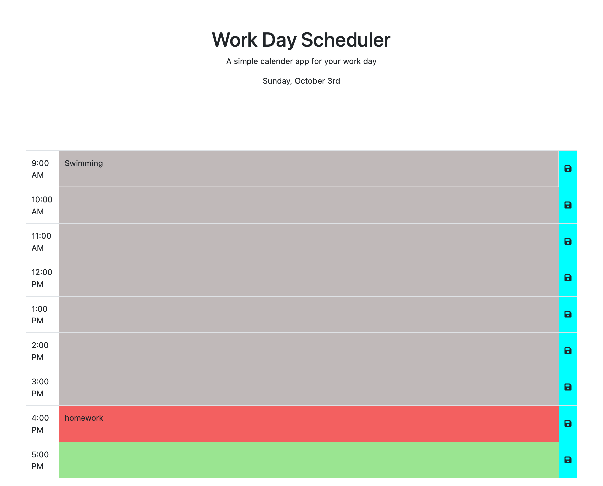

# Third-Party APIs: Work Day Scheduler

```
The purpose of this project is to create a simple calendar application that allows the user to save events for each hour of the day. This app will run in the browser and feature dynamically updated HTML and CSS powered by jQuery.
```

# User Story

As an employee with a busy schedule. 
I want to add important events to a daily planner. 
So that I can manage my time effectively.

## Acceptance Criteria

```
* GIVEN I am using a daily planner to create a schedule.

* WHEN I open the planner. 
THEN the current day is displayed at the top of the calendar.

* WHEN I scroll down. 
THEN I am presented with timeblocks for standard business hours.

* WHEN I view the timeblocks for that day.
THEN each timeblock is color coded to indicate whether it is in the PAST, PRESENT, or FUTURE.

* WHEN I click into a timeblock 
THEN I can enter an event.

* WHEN I click the SAVE button for that timeblock 
THEN the text for that event is saved in local storage.

* WHEN I refresh the page 
THEN the saved events persist.
```

Website: https://evgeniii7.github.io/05-Work-Day-Scheduler/



